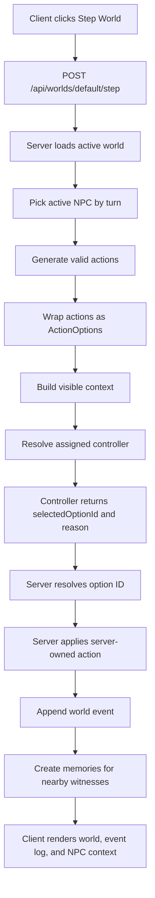

# Tilefolk Project Handoff

This document is a continuity handoff for a fresh AI coding assistant or a new local setup. It captures the project context, architecture decisions, collaboration style, current state, and next work so the project can continue without the original long Codex conversation history.

## Project Identity

Tilefolk is a full-stack TypeScript simulation project about tiny NPCs living in a tile world. It is loosely inspired by low-fi RimWorld-like simulation, but the focus is not manual player control. The core experiment is emergent behavior from NPCs whose choices are made by deterministic controllers or LLM-backed controllers.

Live demo:

```txt
https://tf.qcfailed.com
```

Current checkpoint:

```txt
v0.2.2
```

Current active branch at time of this handoff:

```txt
feature/provider-test-panel
```

Current active roadmap file:

```txt
NEXT_STEPS.md
```

## User And Collaboration Context

The maintainer is Brandon. He is learning full-stack development through this project and wants to become a developer.

Important collaboration preferences:

- Brandon usually wants to write meaningful implementation code himself.
- The assistant should act as tutor, reviewer, architectural guide, and debugging partner.
- The assistant may take over repetitive/mechanical work when explicitly asked, especially tests, cleanup, docs, and copy-paste refactors after Brandon understands the pattern.
- Do not be sycophantic. Push back when Brandon’s implementation or architecture choice is likely to cause problems.
- Explain the why, not just the what.
- Mermaid diagrams are extremely helpful for Brandon. Use them for non-trivial architecture, data flow, and runtime flow explanations.
- Keep explanations practical and tied to this repo.
- Brandon likes a warm, hyped, casual tone, but still wants serious engineering judgment.
- He strongly prefers SSOT discipline: one source of truth, avoid duplicated state and duplicated version values.
- Keep `NEXT_STEPS.md` updated after meaningful milestones.

Personal workflow note:

Brandon was using Codex on Windows but is likely switching permanently to CachyOS/Linux and may use the Zed agent with his ChatGPT subscription instead. The new assistant may not have access to prior Codex memories or the old GUI workflow.

## Repo Shape

Workspace:

```txt
apps/client       React + Vite UI
apps/server       Express API and simulation engine
packages/shared   Shared TypeScript types and helpers
```

Useful root scripts:

```bash
npm install
npm run dev
npm run build
npm run typecheck
npm test
npm run lint
```

Local URLs:

```txt
Client dev: http://localhost:5173
Server API: http://localhost:4000
Production-style local build: http://localhost:4000 after npm run build && npm run start -w apps/server
```

Server env file:

```txt
apps/server/.env
```

Never commit the real `.env`.

## Core Architecture Rules

The server owns world state and legal actions. Controllers, including LLMs, only choose from server-generated options.

Core runtime flow:

```txt
validActions
-> actionOptions
-> visible context
-> controller assignment
-> controller decision
-> selectedOptionId
-> selectedOption.action
-> apply action
-> event log
```

Mermaid version:



Important design rule:

```txt
Controller selects.
Engine owns.
Reason explains.
```

Interpretation:

- Controllers never author raw action objects.
- LLMs never mutate the world.
- LLMs choose a `selectedOptionId`.
- The server resolves that ID against its own `ActionOption[]`.
- If a controller returns invalid output, the engine falls back safely.

## Current Simulation Features

Working:

- 25x25 generated tile world.
- Grass tiles.
- NPCs, trees, ground items, inventory items.
- Movement in 8 directions.
- Wait action.
- Pickup action.
- Axe-gated tree chopping.
- Trees have hit points.
- Depleted trees are removed.
- Chopped trees drop wood.
- Wood is a normal item and can be picked up.
- Events are appended to `world.events`.
- Events can include controller reason, duration, label, and position.
- NPCs have local memories.
- Positioned events create memories for nearby witness NPCs.
- LLM prompts use NPC-local memories rather than global recent events.

## Provider/Controller State

Supported controller/provider families:

- deterministic
- OpenCode Go
- Google AI
- OpenRouter
- Cerebras

Provider keys/models live in server env variables:

```txt
TILEFOLK_ADMIN_TOKEN=
TILEFOLK_DEFAULT_CONTROLLER=deterministic
TILEFOLK_USE_SAMPLE_CONTROLLER_ASSIGNMENTS=false

OPENCODE_GO_API_KEY=
OPENCODE_GO_MODEL=deepseek-v4-flash

GOOGLE_AI_API_KEY=
GOOGLE_AI_MODEL=gemma-4-26b-a4b-it

OPENROUTER_API_KEY=
OPENROUTER_MODEL=poolside/laguna-xs.2:free

CEREBRAS_API_KEY=
CEREBRAS_MODEL=gpt-oss-120b
```

Important observed provider behavior:

- OpenCode Go has been reliable and reasonably fast because it is paid.
- Cerebras paid tier was extremely fast and useful for this simulation.
- Some free endpoints are unreliable, rate-limited, or return malformed/non-JSON output.
- Cerebras free tier has very low rate limits and can get queue/rate-limit errors.
- OpenRouter free endpoints can be useful but inconsistent.
- Google/Gemma via AI Studio became slower/less attractive than expected for live stepping.

Current reason for provider test panel:

Tilefolk needs an in-app way to test which configured provider/model combos are working, fast, and returning parseable decisions before changing live simulation defaults.

## Admin/Deployment State

Deployment target:

```txt
Coolify on Hetzner VPS
Domain through Cloudflare
Live app: https://tf.qcfailed.com
```

Current production setup:

- Express serves API and built React client from one container.
- Dockerfile and `.dockerignore` exist.
- `DEPLOYMENT.md` documents Coolify deployment details.
- The deploy branch is `master`, not `main`.

Important deployment lessons:

- Coolify must point at `master`.
- Environment variables/secrets should be runtime-only unless actually needed at build time.
- `NODE_ENV=production` at build time caused `npm ci` to skip dev dependencies, which made `tsc` missing.
- `.dockerignore` excludes `*.tsbuildinfo` so stale TypeScript build info does not break clean Docker builds.
- Root `npm run build` builds shared, then client, then server.

Mutation protection:

- Public visitors can view the world.
- Step/Reset are protected when `TILEFOLK_ADMIN_TOKEN` is configured.
- Current legacy admin header is:

```txt
x-tilefolk-admin-token
```

Future cleanup planned:

- Replace this with `Authorization: Bearer <token>`.

## Release Process

Semantic versions are intentional, not automatic.

Current tags/checkpoints:

```txt
v0.1.0 first working checkpoint
v0.2.0 NPC-local memory milestone
v0.2.1 axe/resource loop
v0.2.2 deployment/showcase checkpoint
```

When bumping a public checkpoint:

- Update root `package.json`.
- Update workspace package versions if appropriate.
- Include `package-lock.json`.
- Update README checkpoint/status text.
- Update `NEXT_STEPS.md` if roadmap changes.
- Create a matching git tag.
- Patch versions for small fixes/polish.
- Minor versions for meaningful early-stage capabilities.
- Major version is for a future stable public contract, not soon.

## Formatting And Tooling

Root `.prettierrc` was added to stop editor format churn:

```json
{
  "singleQuote": true,
  "trailingComma": "all",
  "printWidth": 100
}
```

Reason:

Zed/Prettier was formatting touched files with double quotes, while the repo convention was single quotes. Keep the repo on single quotes.

ESLint ignores workspace build output:

```txt
**/dist/**
**/build/**
node_modules/**
```

This matters because local `npm run build` creates `apps/server/dist`, and lint should not scan generated JS.

## Current Active Slice: Provider Test Panel

Current branch:

```txt
feature/provider-test-panel
```

Current checkpoint completed before this handoff:

- Added shared `ProviderTestResult`.
- Added protected fake route:

```txt
POST /api/providers/test
```

- Route uses `requireAdminToken`.
- Route currently returns static fake `ProviderTestResult[]`.
- Tests were added for:
  - rejection without admin token when token is configured
  - success with correct token
  - response is an array
  - first result has `provider`, `model`, `success`, `durationMs`, and `message`
- Focused server route test passed.
- Typecheck and lint passed.

Suggested commit message if this is not already committed:

```txt
Add protected provider test endpoint
```

Important: at the time this handoff was requested, `git status` showed the branch as clean in the shell output. That suggests the provider-test checkpoint may already be committed, but verify with:

```bash
git status --short --branch
git log --oneline -5
```

## Next Immediate Work

Next slice within provider test panel:

```txt
Extract provider test target discovery.
```

Goal:

Stop hardcoding one fake Cerebras result inside `apps/server/src/app.ts`.

Create a server-side helper that returns configured provider/model targets from `serverEnv`, without making real LLM calls yet.

Recommended location:

```txt
apps/server/src/providers/providerTestTargets.ts
```

Why `providers/`:

This is operational provider infrastructure, not simulation engine logic.

First helper concept:

```txt
getProviderTestTargets()
```

Possible server-only target shape:

```ts
type ProviderTestTarget = {
  provider: string;
  model: string | null;
  configured: boolean;
};
```

Or, if you want to only return configured targets:

```ts
type ProviderTestTarget = {
  provider: string;
  model: string;
};
```

Recommendation:

For the test panel, include unconfigured providers too if the UI should explain what is missing. But for the first tiny backend helper, returning only configured targets is simpler.

Suggested first version:

- Read `serverEnv`.
- If Cerebras key and model are configured, return Cerebras target.
- If OpenCode Go key and model are configured, return OpenCode Go target.
- If OpenRouter key and model are configured, return OpenRouter target.
- If Google AI key and model are configured, return Google AI target.
- Do not expose API keys.
- Do not call providers yet.

Then update `/api/providers/test`:

- call `getProviderTestTargets()`
- map targets to fake `ProviderTestResult[]`
- message could be `Configured provider test placeholder.`
- duration can be `0`
- success can be `true` for configured targets

Tests to add:

- target discovery returns configured provider/model targets.
- target discovery omits unconfigured providers, or marks them as unconfigured depending chosen shape.
- route uses discovered targets rather than hardcoded Cerebras.

After that:

1. Replace fake result generation with real tiny provider test calls.
2. Keep tests from making real provider calls.
3. Add client panel that calls `/api/providers/test` with admin token.
4. Show provider/model/success/duration/message.

## Important Implementation Patterns

When adding new engine/controller behavior:

- Start with types.
- Add helper with no side effects.
- Add tests around helper behavior.
- Wire into route/engine after helper is solid.
- Keep app routes thin.
- Avoid putting provider-specific logic directly in `app.ts`.
- Keep server-owned secrets on the server.
- Client never receives API keys.

When adding LLM/provider calls:

- Keep raw REST calls where practical.
- Avoid SDKs unless they provide enough value to justify dependency weight.
- Disable/reduce reasoning for fast decision calls unless there is a reason to pay latency/token cost.
- Keep prompts short and action-option based.
- Require structured output.
- Validate selected option IDs against server-owned options.
- On invalid/malformed output, fallback safely.

When adding UI:

- Keep the actual usable app as the first screen, not a marketing page.
- For operational tools, prefer dense, organized, quiet UI.
- Avoid huge hero sections, decorative fluff, or fake features.
- The map should remain the central visual object.
- Keep controls and event logs scannable.

## Existing Useful Concepts/Helpers

Important files and concepts to inspect:

```txt
packages/shared/src/index.ts
apps/server/src/app.ts
apps/server/src/auth/requireAdminToken.ts
apps/server/src/simulation/stepWorld.ts
apps/server/src/simulation/getValidActions.ts
apps/server/src/simulation/getValidMovementActions.ts
apps/server/src/simulation/getActionOptions.ts
apps/server/src/simulation/controllers/
apps/server/src/simulation/controllers/controllerAssignments.ts
apps/server/src/simulation/controllers/deterministicController.ts
apps/server/src/simulation/controllers/llmController.ts
apps/server/src/simulation/controllers/*DecisionClient.ts
apps/server/src/simulation/controllers/formatVisibleContext.ts
apps/server/src/simulation/memories/
apps/client/src/App.tsx
apps/client/src/features/
```

Shared helpers:

- `directions`
- `Direction`
- `Position`
- `World`
- `NpcAction`
- `getVisibleWorldContext`
- `isPositionInSquareRadius`

Current provider result type:

```ts
export type ProviderTestResult = {
  provider: string;
  model: string;
  success: boolean;
  durationMs: number;
  message: string;
};
```

## What Not To Do Next

Avoid these until the provider test panel has a basic server route, target discovery, real test calls, and simple UI:

- Do not add persistence yet unless production resets become urgent.
- Do not add complex auth/accounts.
- Do not build a provider/model assignment UI before basic provider health testing.
- Do not add new gameplay systems before stabilizing provider testing if the current branch is still active.
- Do not add streaming/time-to-first-token in the first real provider test unless the simple total-duration test is already working.

## Recommended Next Conversation Prompt

If starting fresh with a new AI assistant, paste this:

```txt
Read HANDOFF.md, AGENTS.md, README.md, and NEXT_STEPS.md. We are continuing Tilefolk on the provider test panel slice. I want to code the meaningful parts myself, so guide/review first. Start by checking git status and the current ProviderTestResult/POST /api/providers/test state, then help me extract provider test target discovery into apps/server/src/providers/providerTestTargets.ts without making real LLM calls yet.
```

## Emotional/Continuity Note

This project matters to Brandon as a learning path and motivation engine. It has been built through many short sessions around work/family life, including lunch breaks and late-night sessions. Keep the momentum alive, but do not rush architecture into a mess. The best collaboration style is energetic, honest, and concrete:

- celebrate real milestones
- keep slices small
- explain tradeoffs
- protect SSOT
- keep tests meaningful
- avoid derailing into shiny future systems before the current slice is green

