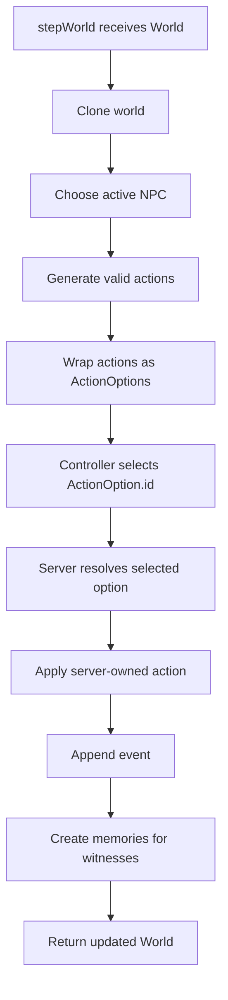
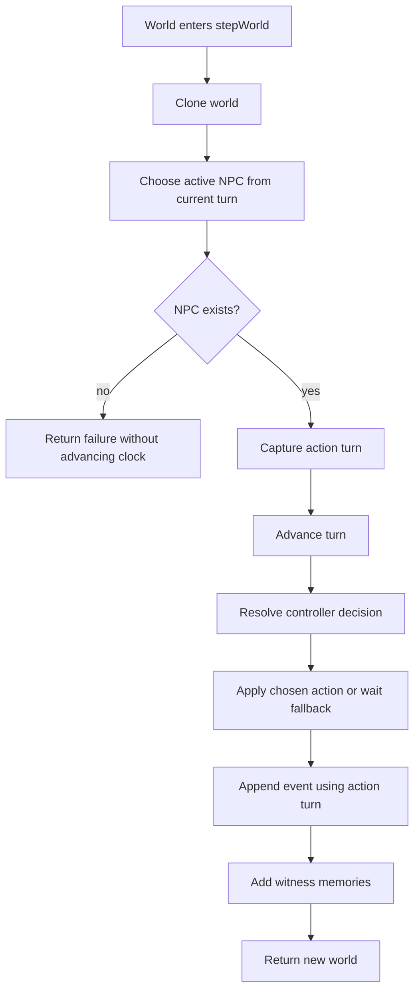

# Tilefolk Handoff — Round Tracking Slice

This handoff is for a fresh assistant or mobile GPT chat continuing Tilefolk after the `v0.3.0` Provider Test Panel milestone. The current work is **round tracking** in the simulation engine.

## Project Identity

Tilefolk is a full-stack TypeScript simulation project about tiny NPCs living in a tile world. The core experiment is emergent NPC behavior driven by deterministic or LLM-backed controllers.

Live demo:

```txt
https://tf.qcfailed.com
```

Current completed checkpoint:

```txt
v0.3.0 — Provider Test Panel MVP
```

Current likely feature branch:

```txt
feat/round-tracking
```

If needed, create/switch with:

```sh
git switch -c feat/round-tracking
```

## Collaboration Style

Brandon wants to implement most Tilefolk code himself. Default to tutor/reviewer mode:

- Give one small next step.
- Explain the goal and constraints.
- Let Brandon code.
- Review directly and kindly.
- Correct mental models instead of just giving copy/paste solutions.

Important preferences:

- Keep SSOT discipline front and center.
- Prefer DRY, testable, maintainable seams.
- Avoid overbuilding future systems before they have real pressure.
- Use Mermaid diagrams when explaining runtime flow or architecture.
- Keep `NEXT_STEPS.md` current after meaningful milestones.

## Core Architecture Rules

Server owns world state and legal actions.

Controllers, including LLMs:

- do not author raw actions
- do not mutate the world
- choose from server-generated `ActionOption.id` values

Server:

- generates legal actions
- wraps them as `ActionOption[]`
- asks a controller to select an option ID
- validates the selected ID
- applies the server-owned action

Short rule:

```txt
Controller selects.
Engine owns.
Reason explains.
```

Current simulation flow:



## Recently Completed Milestone

Provider Test Panel MVP is complete and tagged:

```txt
v0.3.0
```

Completed:

- PR #14 `Add provider test panel` merged into `master`.
- Local `master` updated to merge commit `5da883c`.
- Tag `v0.3.0` created and pushed.
- App manually redeployed on Coolify because automatic deploy did not detect the merge/tag.
- Need to investigate Coolify deploy trigger later; maybe it only reacts to direct pushes to `master`.

Provider Test Panel state:

- Client has an admin-protected “LLM Diagnostics” panel.
- Backend has `/api/providers/test`.
- Provider tests run real decision-contract probes.
- Server creates a tiny valid `ActionOption`.
- Model must select the expected option ID.
- Server validates selected ID.

Live verified providers:

- Cerebras ✅
- OpenCode Go ✅
- OpenRouter ✅
- Google AI / Gemma ✅

Important provider notes:

- Cerebras business API limit now works and is fast enough for live-ish 4-NPC rounds.
- Google/Gemma worked with inline controller instruction in `contents`; SDK config fields were unreliable.

## Current Active Slice: Round Tracking

The next fun simulation feature is **round tracking**.

Current behavior:

- `turn` advances every NPC action.
- Active NPC selection currently derives from `turn` and the NPC array length.
- Events record the pre-advance action turn.

Desired new behavior:

- Add `round` to track completed full cycles through the current NPC roster.
- `round` starts at `0`.
- `round` increments only after each NPC has acted once in the current simple cycle.

Example with 4 NPCs:

| Before Step     | Acting NPC | After `turn` | After `round` |
| --------------- | ---------- | ------------ | ------------- |
| turn 0, round 0 | npc_0      | turn 1       | round 0       |
| turn 1, round 0 | npc_1      | turn 2       | round 0       |
| turn 2, round 0 | npc_2      | turn 3       | round 0       |
| turn 3, round 0 | npc_3      | turn 4       | round 1       |
| turn 4, round 1 | npc_0      | turn 5       | round 1       |

Why this matters:

- prepares for future hunger
- tiredness
- sleep
- growth
- weather
- world ticks
- broader simulation rhythms that should happen less often than every single NPC action

## Important Design Decision Already Discussed

Brandon correctly pointed out that Tilefolk will eventually need dynamic roster behavior:

- NPC death
- NPC birth
- sleeping
- skipped turns
- active/inactive actors

The concern:

- A simple `turn % npcs.length` model is fragile long-term.
- Death could maybe use a `living` flag, but birth still complicates the model.
- Sleeping/skipping also complicates round completion.

Decision for this slice:

- Do **not** implement the full dynamic roster / explicit turn-order system yet.
- Do **not** pretend dynamic roster does not matter.
- Add a small helper/seam now so the modulo-based logic is localized and easier to replace later.

Recommended future model, not for this slice:

```txt
At the start of a round, snapshot eligible actor IDs.
Then step through that per-round actor list.
Births/sleep/wake/death rules can decide whether changes apply immediately or next round.
```

For now:

```txt
Use current fixed-roster behavior, but route actor selection and turn/round advancement through clear helper functions.
```

## TypeScript TDD Guidance From This Chat

Brandon asked whether tests should be written before `round` exists on the `World` type, or whether the type should be updated first.

Guidance agreed on:

In TypeScript, when a new public shape/property does not exist yet, it is normal to add the smallest type/model shape first so behavior tests can compile.

Recommended order:

1. Add `round: number` to the shared `World` type.
2. Initialize `round: 0` in `createWorld()`.
3. Fix only the direct `World` literals TypeScript forces you to fix.
4. Add behavior tests for `stepWorld` round tracking.
5. Watch those tests fail because behavior is missing, not because the type cannot compile.
6. Implement the small turn-clock helper/seam and round advancement.

Mental model:

```txt
If the failing test cannot compile because the public shape does not exist,
add the smallest public shape first.
Then write the failing behavior test.
Then implement behavior.
```

This is still test-first in spirit because the behavior is not implemented before the behavior tests.

## Detailed Checklist

The detailed pass/fail requirements are in:

```txt
todo-6-15.md
```

Mobile GPT should read that file too. It contains the current coding checklist and acceptance requirements without giving full implementation code.

High-level checklist:

- Add `round` to shared `World`.
- Initialize generated worlds with `round = 0`.
- Update direct typed `World` literals.
- Add round tracking tests in `apps/server/src/simulation/stepWorld.test.ts`.
- Add a small helper seam for actor selection and turn/round advancement.
- Preserve existing event turn semantics.
- Optionally display round in the client only after engine tests pass.
- Update `NEXT_STEPS.md` with the future dynamic-turn-order note.

## Relevant Files

Shared world type:

```txt
packages/shared/src/index.ts
```

World generation:

```txt
apps/server/src/simulation/worldGenerator.ts
```

Main engine flow:

```txt
apps/server/src/simulation/stepWorld.ts
```

Main test file for this slice:

```txt
apps/server/src/simulation/stepWorld.test.ts
```

Known direct `World` literals likely needing `round`:

```txt
apps/server/src/simulation/addMemoriesForWitnesses.test.ts
apps/server/src/simulation/getActionOptions.test.ts
packages/shared/src/getVisibleWorldContext.test.ts
```

Optional client display:

```txt
apps/client/src/App.tsx
```

Roadmap:

```txt
NEXT_STEPS.md
```

## Current `World` Shape Before This Slice

At the start of the round-tracking slice, shared `World` did not have `round` yet.

Existing shape included:

```txt
id
width
height
tiles
npcs
items
trees
turn
events
```

The intended new field is:

```txt
round
```

Place it near `turn` for clarity.

## Current `stepWorld` Behavior Before This Slice

Important behavior to preserve:

- `stepWorld` clones the input world.
- It should not mutate the original world.
- It chooses the active NPC based on current turn.
- It captures the pre-increment turn as the action/event turn.
- It increments `turn` once per successful NPC attempt.
- Events continue to record the attempted/action turn.
- Memories inherit the event turn.
- No-NPC failure does not advance turn.

Current conceptual flow:



This slice should avoid accidentally changing event/memory turn semantics.

## Round Tracking Requirements

Core pass/fail requirements:

- `round` starts at `0`.
- After the first NPC in a 4-NPC world acts, `turn` becomes `1` and `round` stays `0`.
- After the fourth NPC in a 4-NPC world acts, `turn` becomes `4` and `round` becomes `1`.
- Original world `round` is not mutated.
- No-NPC failure does not advance `turn` or `round`.
- Existing turn/event/memory tests still pass.

## What Not To Do In This Slice

Do not implement yet:

- NPC birth
- NPC death
- sleeping
- skipped turns
- living/dead flags
- explicit per-round actor snapshots
- hunger/weather/growth ticks
- persistence
- full scheduler system

Future note to preserve:

```txt
Before adding birth/death/sleep, replace simple modulo actor selection with explicit per-round actor snapshots or another tested turn-order state model.
```

## Follow-Up Tooling/Deployment Slices Later

Not current work, but still relevant later:

- Add `npm run verify` for typecheck/test/build/lint.
- Fix dev-only npm audit warning from `tsx`/`esbuild` if needed.
- Investigate why Coolify auto-deploy did not detect the merge/tag.
- Maybe Coolify only reacts to direct pushes to `master`.

## Suggested Prompt For Mobile GPT

If starting a mobile chat, paste something like:

```txt
Read HANDOFF.md and todo-6-15.md. We are working on Tilefolk round tracking after v0.3.0. I want tutor/reviewer help, not full implementation unless I ask. We decided to store round on World, keep dynamic roster redesign for later, and add a small helper seam around actor selection and turn/round advancement. I asked whether to write tests before the type exists; guidance was to add the smallest TypeScript shape first, then behavior tests. Help me reason through the next small step and review my code.
```

## Encouragement / Continuity Note

This project is both a learning path and a motivation engine for Brandon. Keep the momentum warm but disciplined. Celebrate the `v0.3.0` milestone, then keep this slice small and testable. The goal is not to design the perfect life/death/sleep scheduler today; the goal is to add round tracking without making that future harder.
