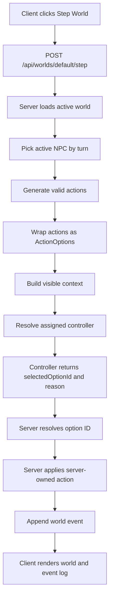

# Tilefolk

Tilefolk is an early full-stack TypeScript simulation project about tiny NPCs living on a tile grid, choosing actions through deterministic or LLM-backed controllers.

The current focus is not fancy graphics yet. The goal is to build a clean simulation engine where the server owns world state, generates legal action options, and lets controllers choose from those options. World state is currently in memory; persistence will come later.

Live demo: https://tf.qcfailed.com

## What Works Now

- 25x25 tile world generation
- NPCs, trees, and ground/inventory items
- Legal movement, wait, pickup, and chop tree actions
- Axe-gated tree chopping with durability
- Depleted trees drop wood items that NPCs can pick up
- Server-generated `ActionOption[]` menus
- Mixed controller assignments per NPC
- Deterministic controller
- LLM provider clients for OpenCode Go, Google AI, OpenRouter, and Cerebras
- Visible-world context for prompts and UI debugging
- NPC-local memories for witnessed events
- Event log with action reason, controller label, model, and duration
- Admin-token protection for Step/Reset mutation routes
- Admin-protected provider test panel for live LLM provider/model diagnostics
- Decision-contract provider probes for OpenCode Go, Google AI, OpenRouter, and Cerebras
- Docker/Coolify deployment at `tf.qcfailed.com`
- Shared TypeScript package for core types and helpers

## Architecture



The LLM never authors raw action objects. It only chooses an option ID from the server-generated menu.

## Workspace

```txt
apps/client       React + Vite UI
apps/server       Express API and simulation engine
packages/shared   Shared TypeScript types and helpers
```

## Setup

Prerequisites:

- Node.js
- npm

Install dependencies:

```bash
npm install
```

Copy the server env example.

Windows PowerShell:

```bash
copy apps\server\.env.example apps\server\.env
```

macOS/Linux:

```bash
cp apps/server/.env.example apps/server/.env
```

Then fill in any provider keys you want to use. The app can run deterministically without LLM keys.

Important: never commit the real `.env` file.

## Environment Variables

Server env vars live in `apps/server/.env`.

```txt
TILEFOLK_ADMIN_TOKEN=
TILEFOLK_DEFAULT_CONTROLLER=deterministic
TILEFOLK_USE_SAMPLE_CONTROLLER_ASSIGNMENTS=false

OPENCODE_GO_API_KEY=
OPENCODE_GO_MODEL=deepseek-v4-flash

GOOGLE_AI_API_KEY=
GOOGLE_AI_MODEL=gemma-4-26b-a4b-it

OPENROUTER_API_KEY=
OPENROUTER_MODEL=poolside/laguna-xs.2:free

CEREBRAS_API_KEY=
CEREBRAS_MODEL=gpt-oss-120b
```

## Optional Provider Credits

Tilefolk can use OpenCode Go as one optional LLM provider.

- OpenCode Go: https://opencode.ai/go
- Referral link: https://opencode.ai/go?ref=9NJEMZBJBM

The referral link gives both new users and the project maintainer $5 in credit. The normal link works fine if you do not want to use a referral.

## Controller Configuration

By default, Tilefolk can run without LLM API keys:

```txt
TILEFOLK_DEFAULT_CONTROLLER=deterministic
TILEFOLK_USE_SAMPLE_CONTROLLER_ASSIGNMENTS=false
```

With that setup, every NPC uses the deterministic controller.

To make every NPC use the default LLM controller, set:

```txt
TILEFOLK_DEFAULT_CONTROLLER=llm
TILEFOLK_USE_SAMPLE_CONTROLLER_ASSIGNMENTS=false
```

Right now, the default LLM controller uses OpenCode Go. Make sure `OPENCODE_GO_API_KEY` and `OPENCODE_GO_MODEL` are set.

To try mixed NPC controllers, set:

```txt
TILEFOLK_USE_SAMPLE_CONTROLLER_ASSIGNMENTS=true
```

Sample assignments currently live in:

```txt
apps/server/src/simulation/controllers/controllerAssignments.ts
```

Edit that file to choose which NPC uses deterministic control, OpenCode Go, Google AI, or OpenRouter. Per-NPC model overrides are supported there until the project has a UI for changing controllers and models live.

## Run Locally

Start client and server together:

```bash
npm run dev
```

Common URLs:

```txt
Client: http://localhost:5173
Server: http://localhost:4000
```

The world can be viewed without an admin token. Step and Reset are protected mutation actions; enter the `TILEFOLK_ADMIN_TOKEN` value in the UI to use them when token protection is configured.

## Checks

```bash
npm run typecheck
npm test
npm run lint
```

## Current Roadmap

See `NEXT_STEPS.md`.

The `v0.3.0` checkpoint completed the Provider Test Panel MVP. The next pass will build on that reliability work with selected-provider runs, richer diagnostics, tooling cleanup, or the next simulation feature slice.

## AI-Assisted Development

Tilefolk is being built as a learning project with AI assistance. I use ChatGPT/Codex as a tutor, reviewer, planning partner, and pair-programming assistant.

My goal is to write and understand the code myself. AI help is mainly used for architecture discussion, debugging guidance, code review, repetitive cleanup, and some mechanical test or refactor work after I understand the pattern.

The project decisions, implementation direction, and learning process are intentionally human-led.

## Status

Current checkpoint: `v0.3.0`

Tilefolk is still pre-public and changing quickly. Expect types, world shape, and controller contracts to evolve while the simulation model gets sharper.
