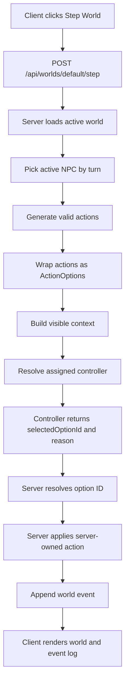

# Tilefolk

Tilefolk is an early TypeScript MERN-style simulation project about tiny NPCs living on a tile grid, choosing actions through deterministic or LLM-backed controllers.

The current focus is not fancy graphics yet. The goal is to build a clean simulation engine where the server owns world state, generates legal action options, and lets controllers choose from those options.

```txt
The controller selects.
The engine owns.
The reason explains.
```

## What Works Now

- 50x50 tile world generation
- NPCs, trees, and ground/inventory items
- Legal movement, wait, and pickup actions
- Server-generated `ActionOption[]` menus
- Mixed controller assignments per NPC
- Deterministic controller
- LLM provider clients for OpenCode Go, Google AI, and OpenRouter
- Visible-world context for prompts and UI debugging
- Event log with action reason, controller label, model, and duration
- Admin-token protection for Step/Reset mutation routes
- Shared TypeScript package for core types and helpers

## Architecture



The LLM never authors raw action objects. It only chooses an option ID from the server-generated menu.

## Workspace

```txt
apps/client       React + Vite UI
apps/server       Express API and simulation engine
packages/shared   Shared TypeScript types and helpers
```

## Setup

Install dependencies:

```bash
npm install
```

Copy server env example:

```bash
copy apps\server\.env.example apps\server\.env
```

Then fill in any provider keys you want to use. The app can run deterministically without LLM keys.

Important: never commit the real `.env` file.

## Environment Variables

Server env vars live in `apps/server/.env`.

```txt
TILEFOLK_ADMIN_TOKEN=
TILEFOLK_DEFAULT_CONTROLLER=deterministic
TILEFOLK_USE_SAMPLE_CONTROLLER_ASSIGNMENTS=false

OPENCODE_GO_API_KEY=
OPENCODE_GO_MODEL=deepseek-v4-flash

GOOGLE_AI_API_KEY=
GOOGLE_AI_MODEL=gemma-4-26b-a4b-it

OPENROUTER_API_KEY=
OPENROUTER_MODEL=poolside/laguna-xs.2:free
```

## Run Locally

Start client and server together:

```bash
npm run dev
```

Common URLs:

```txt
Client: http://localhost:5173
Server: http://localhost:4000
```

## Checks

```bash
npm run typecheck
npm test
npm run lint
```

## Current Roadmap

See `NEXT_STEPS.md`.

The next major simulation truth pass is NPC-local memory: NPCs should remember only events they witnessed instead of receiving global recent events.

## Status

Current checkpoint: `v0.1.0`

Tilefolk is still pre-public and changing quickly. Expect types, world shape, and controller contracts to evolve while the simulation model gets sharper.
